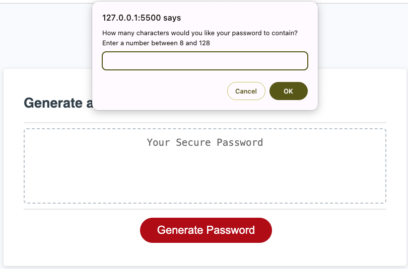

# password-generator
Random Password Generator

## Description

The objective of this project is to consolidate understanding of functions and loops using javascript.

## Installation

Open application in browser, then click on "Generate Password" to start the application.

https://cenamia.github.io/password-generator/

## Usage
Javascript

Provide instructions and examples for use. Include screenshots as needed.

## License

Please refer to the license in the repo
